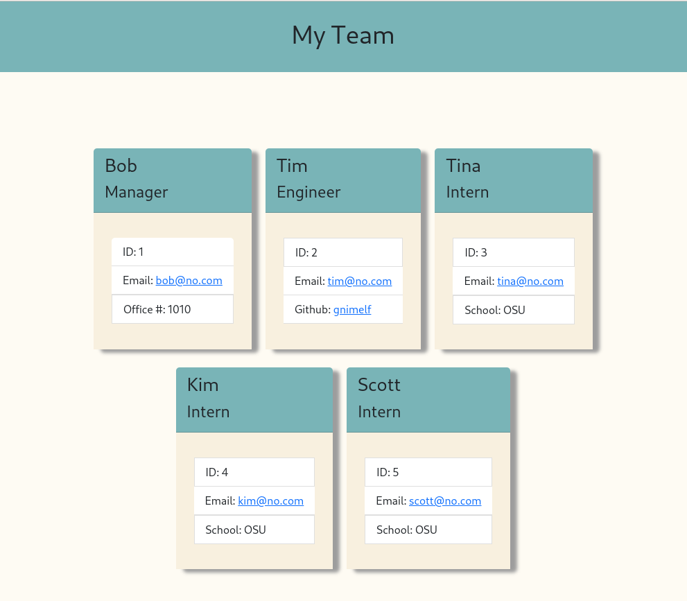

# team-profile-generator

## Description

This is a Node.js command-line application that takes in information about employees on a software engineering team, then generates an HTML webpage that displays summaries for each team member.

## Table of Contents

- [Installation](#installation)
- [Usage](#usage)
- [Demo](#demo)
- [Credits](#credits)
- [License](#license)
- [Badges](#badges)
- [Tests](#tests)

## Installation

1) Download or clone repo
2) Install nodejs https://nodejs.org/en/download/
3) Run `npm i` in terminal while under the repo directory 

## Usage

* Run `node index.js` to start application
* Follow the prompts to add team members and their information
* When `finished` is selected from the prompts, an HTML file will be generated in the `dist` directory.

## Demo
[Demo](https://drive.google.com/file/d/14WOKgPtKrJIgtsavyuAgGH_wHegE-0i2/view?usp=sharing)

## Credits

* inquirer
* jest

## License

## Badges

## Tests

Tests have been written and are under the __tests__ directory
To execute, install packages (npm i) and then run: npm test  
